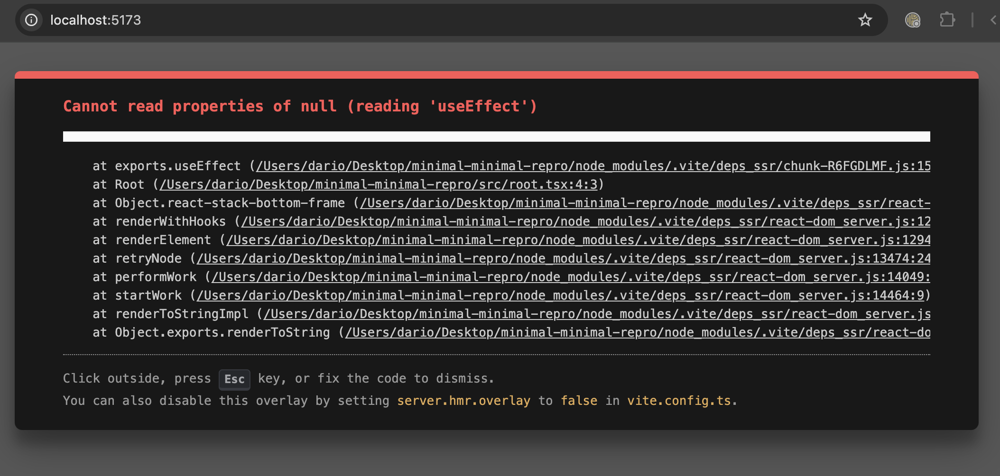

# vite-dev-ssr-prebundling-mid-flight-issue-repro

This is a reproduction showing an issue that happens in Vite Dev server SSR environments when
dependencies get optimized while a request is being handled.

## The issue

The problem is that when new dependencies are optimized a [`fullReload()`](https://github.com/vitejs/vite/blob/353c467610e2d92c0929fa4abd03f2cbd26e34ed/packages/vite/src/node/optimizer/optimizer.ts#L492) is triggered (which [invalidates the environmen's whole module graph](https://github.com/vitejs/vite/blob/353c467610e2d92c0929fa4abd03f2cbd26e34ed/packages/vite/src/node/optimizer/optimizer.ts#L515)). Although this is the generally the expected behavior, this might be problematic when dependencies are discovered while a request is being handled. In such case the state of the environment will be different before and after the reload introducing the risk of inconsistent state, potentially causing problems in the application.

## Reproduction

To run the minimal reproduction simply run:

```
pnpm i
pnpm dev
```

and navigate to dev server's URL, you should see an error such as this:


Refreshing the page will cause the error to go away, running

```
pnpm dev
```

makes the error reappear (since a `predev` script deletes the `node-modules/.vite` directories)

running

```
pnpm vite dev
```

afterwords does not trigger the error (since this only happens then dependencies are getting optimized)

## Additional information

### Virtual Modules

In the reproduction this error is triggered by not providing any entrypoints in `optimizeDeps.entries`, meaning that there is no initial crawling and dependencies are optimized as they are encountered.

The issue can however be triggered even when there is an initial crawling process, simply by using virtual modules since those are not part of the initial crawling process.

> [!Note]
> This is actually the main issue here since many fullstack frameworks
> rely on virtual modules to control how the user's application is run
